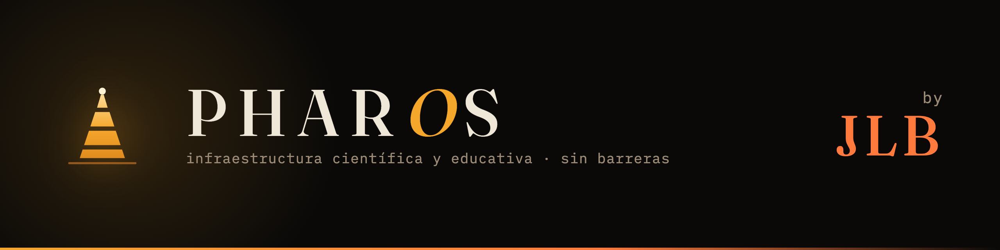

<div align="center">

[](https://kegouro.github.io)

### *La física debería verse, no solo leerse.*

Construyo herramientas abiertas que cualquiera puede tocar y entender — del colegio a la investigación.
El **Pharos Project**: infraestructura científica y educativa sin barreras de entrada.

**[▶ Explorar el ecosistema](https://kegouro.github.io)**  ·  [GitHub](https://github.com/kegouro)  ·  [ORCID](https://orcid.org/0009-0006-8890-4048)  ·  [Zenodo](https://zenodo.org/search?q=orcid:0009-0006-8890-4048)

</div>

---

### 🔆 Didáctico — *web · visual · accesible*

| Repo | Qué hace | Stack | Estado |
| :--- | :--- | :--- | :--- |
| [**parcella**](https://github.com/kegouro/parcella) | Visualizador del elemento diferencial (dl · dS · dV) e integración por regiones | TypeScript · WebGL | [▶ demo](https://kegouro.github.io/parcella/) |
| [**curvana**](https://github.com/kegouro/curvana) | Parametrizaciones de curvas 2D/3D, campos e integrales de línea | TypeScript | ✅ Vivo |
| [**flux**](https://github.com/kegouro/flux) | Campos vectoriales y electrodinámica visual (estructura tipo Griffiths) | TypeScript · WebGL | 🔜 Próximamente |
| [**beamlab-web**](https://github.com/kegouro/beamlab-web) | Óptica paraxial: matrices ABCD y haces gaussianos | TypeScript · WebGL | 🔜 Próximamente |

### 🔬 Instrumentación — *python · laboratorio*

| Repo | Qué hace | Stack | Estado |
| :--- | :--- | :--- | :--- |
| [**spmkit**](https://github.com/kegouro/spmkit) | Análisis de datos AFM/KPFM, validado contra Gwyddion · [info](https://kegouro.github.io/spmkit/) | Python · GUI web | ✅ Vivo |
| [**virtualspm**](https://github.com/kegouro/virtualspm) | Gemelo digital de un SPM: simula → genera → analiza con spmkit | Python | 🔜 Próximamente |
| [**lablog**](https://github.com/kegouro/lablog) | Bitácora LaTeX-nativa local-first: celdas, voz, bóveda, PDF Tectonic, export Jupyter · [docs](https://kegouro.github.io/lablog/) · [PyPI](https://pypi.org/project/jose-labarca-lablog/) | Python · React · KaTeX | ✅ Vivo (v0.3.1) |

### 🛰️ Simulación — *c++ · investigación*

| Repo | Qué hace | Stack | Estado |
| :--- | :--- | :--- | :--- |
| [**BeamLabStudio**](https://github.com/kegouro/BeamLabStudio) | Análisis de trayectorias de haces (Geant4, COMSOL, ROOT) | C++ · Geant4 · ROOT | ✅ Vivo |
| [**MuonSimViewer**](https://github.com/kegouro/MuonSimViewer) | Visualizador de trayectorias de muones (datos COMSOL) | C++ | ✅ Vivo |

### 🧪 Atelier — *experimentos · pruebas de concepto*

| Repo | Qué hace |
| :--- | :--- |
| [**omniconvert**](https://github.com/kegouro/Omniconvert) | Conversor universal de formatos encadenando convertidores por BFS · ✅ Vivo (v1.0.1) · [DOI](https://doi.org/10.5281/zenodo.21303287) |
| [**pagina-web**](https://github.com/kegouro/Pagina-web) | Material para clases online |

---

<div align="center">
<sub>

```
┌─
│ Pharos Project · José Labarca Baeza
└─ USM · Valparaíso · Chile
```

[**kegouro.github.io**](https://kegouro.github.io)

</sub>
</div>
