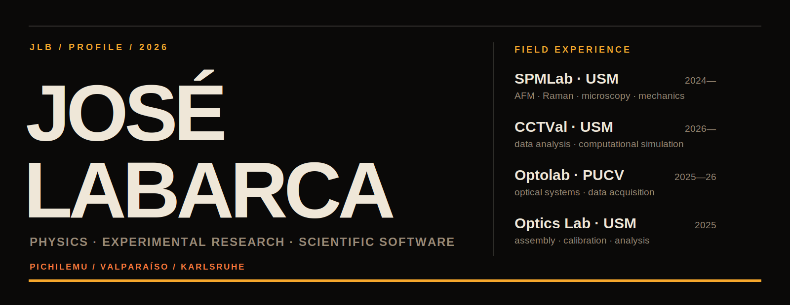
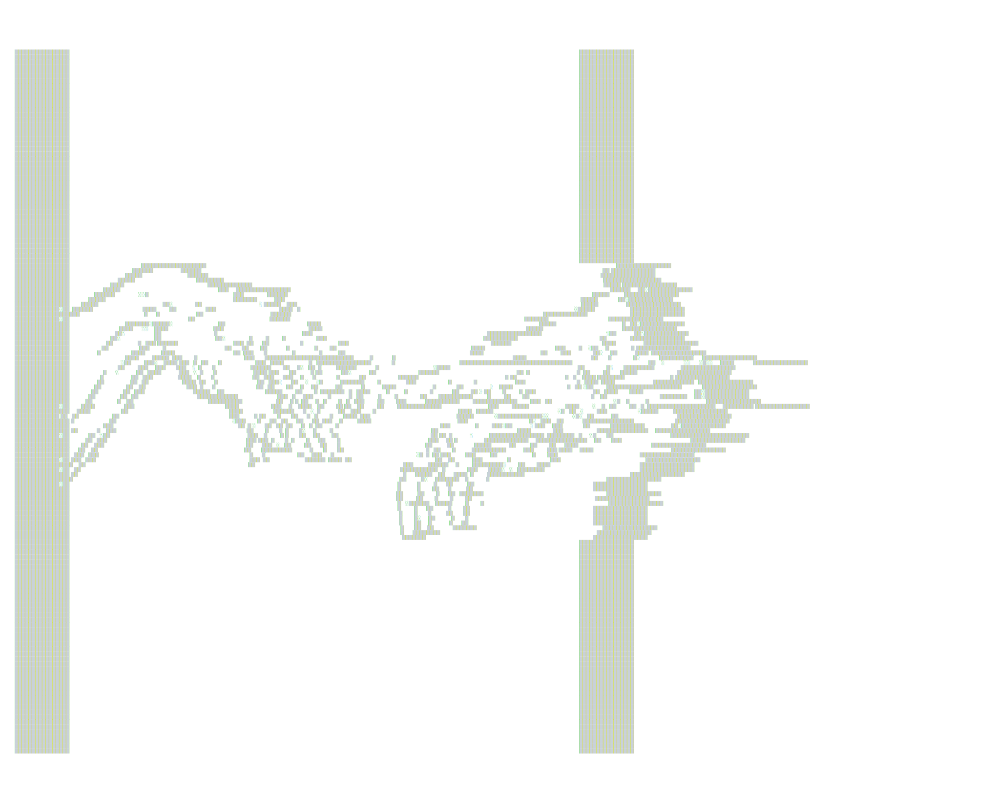

<picture>
  <source media="(prefers-color-scheme: dark)" srcset="./assets/profile-dark.svg">
  <source media="(prefers-color-scheme: light)" srcset="./assets/profile-light.svg">
  
</picture>

<p align="center">
  <a href="#field-experience">FIELD EXPERIENCE</a>&nbsp;&nbsp;·&nbsp;&nbsp;
  <a href="#selected-software">SELECTED SOFTWARE</a>&nbsp;&nbsp;·&nbsp;&nbsp;
  <a href="#trajectory">TRAJECTORY</a>&nbsp;&nbsp;·&nbsp;&nbsp;
  <a href="#project-index">PROJECT INDEX</a>
</p>

<br>

Undergraduate Physics student at **Universidad Técnica Federico Santa María** in Valparaíso, Chile. My work spans experimental biophysics, optics, computational particle physics and open-source scientific software.

I currently focus on **AFM/SPM analysis**, public dataset curation, scientific validation and research software designed for use beyond a single experiment.

> **What in a result comes from the sample, and what comes from the pipeline?**

<p align="center">
  <picture>
    <source media="(prefers-color-scheme: dark)" srcset="./assets/ascii-art-dark.svg">
    <source media="(prefers-color-scheme: light)" srcset="./assets/ascii-art-light.svg">
    
  </picture>
</p>
<p align="center"><sub>The Creation of Adam</sub></p>

<br>

<a id="field-experience"></a>
## 01 / FIELD EXPERIENCE

| PERIOD | LABORATORY | WORK |
|:--|:--|:--|
| **2024—present** | **SPMLab · USM** | Biological and material samples; optical microscopy, AFM, Raman spectroscopy, mechanical traction testing and 3D cell-culture training. |
| **2026—present** | **CCTVal · USM** | Data analysis and computational simulation for research projects. |
| **2025—2026** | **Optolab · PUCV** | Optical and optoelectronic systems, experimental setups and data acquisition. |
| **Jan—Jul 2025** | **Optics Laboratory · USM** | Design, assembly and calibration of optical experiments; quantitative data analysis. |

<details>
<summary><strong>METHODS / SOFTWARE / ENVIRONMENTS</strong></summary>

<br>

**Laboratory**  
AFM · Raman spectroscopy · optical microscopy · sample preparation · mechanical testing · 3D cell culture · optical alignment and calibration

**Programming**  
Python · C++ · TypeScript · JavaScript · HTML/CSS

**Scientific stack**  
NumPy · Pandas · Matplotlib · PyTorch · TensorFlow · Scikit-learn · Geant4 · CERN ROOT · COMSOL · Gwyddion

**Workflow**  
Git · GitHub · Linux/Bash · LaTeX · GitHub Actions · CI/CD

</details>

<br>

<a id="selected-software"></a>
## 02 / SELECTED SOFTWARE

### 01 · [SPM-Kit / Fathom](https://github.com/kegouro/spmkit)

Open-source numerical engine and desktop workspace for scanning probe microscopy. Supports AFM/KPFM image analysis, force spectroscopy, quantitative nanomechanics, resonance analysis, scientific export and validation workflows.

`Python` · `PyQt6` · `AFM/KPFM` · `force spectroscopy`

---

### 02 · [SPM-Kit Data Hunter](https://github.com/kegouro/spmkit-data-hunter) `LATEST`

Search and curation system for public AFM/SPM datasets. It inventories files, preserves provenance and classifies what each record can support for parser tests, method reconstruction, cross-checking or benchmark validation.

`Python` · `CLI` · `open data` · `metadata` · `validation`

---

### 03 · [BeamLabStudio](https://github.com/kegouro/BeamLabStudio)

Particle-beam trajectory analysis for Geant4, COMSOL and CERN ROOT data, with interactive visualization, beam metrics, Monte Carlo post-processing and research-oriented reporting.

`C++20` · `Qt 6` · `Geant4` · `ROOT`

---

### 04 · [lablog](https://github.com/kegouro/lablog)

Local-first, LaTeX-native electronic laboratory notebook with live preview, executable cells, voice input, encrypted local storage, Tectonic PDF compilation and Jupyter export.

`Python` · `FastAPI` · `React` · `TypeScript` · `KaTeX`

<br>

<a id="trajectory"></a>
## 03 / TRAJECTORY

```text
2024        SPMLab · research entry during second undergraduate year
2025        optics research · poster presentation at CNN9
2026        CCTVal · Santander International Mobility Fellowship
OCT 2026    exchange semester · Karlsruhe Institute of Technology
JUN 2027    expected B.Sc. Physics graduation
```

<details>
<summary><strong>ACADEMIC RECORD</strong></summary>

<br>

- **B.Sc. Physics**, Universidad Técnica Federico Santa María, 2023—present.
- **Incoming exchange student**, Karlsruhe Institute of Technology, October 2026—March 2027.
- **Santander International Mobility Fellowship**, academic excellence award supporting the KIT exchange.
- **Poster presenter**, IX National Congress of Nanotechnology, La Serena, November 2025.
- English: advanced, IELTS certified and accepted by KIT for higher education.

</details>

<br>

<a id="project-index"></a>
## 04 / PROJECT INDEX

<details open>
<summary><strong>VISUAL PHYSICS / EDUCATION</strong></summary>

<br>

| PROJECT | SCOPE |
|:--|:--|
| [**parcella**](https://github.com/kegouro/parcella) | Differential elements, coordinate systems, Jacobians and region-based integration. |
| [**curvana**](https://github.com/kegouro/curvana) | Parametric curves, Frenet–Serret frames, fields and line integrals in 2D/3D. |

</details>

<details>
<summary><strong>EARLIER / AUXILIARY TOOLS</strong></summary>

<br>

| PROJECT | SCOPE |
|:--|:--|
| [**MuonSimViewer**](https://github.com/kegouro/MuonSimViewer) | COMSOL muon-trajectory viewer and conceptual predecessor to BeamLabStudio. |
| [**Omniconvert**](https://github.com/kegouro/Omniconvert) | Format conversion through graph search over available converters. |

</details>

<details>
<summary><sub>IN DEVELOPMENT / LOWER VISUAL PRIORITY</sub></summary>

<br>

| PROJECT | DIRECTION |
|:--|:--|
| [virtualspm](https://github.com/kegouro/virtualspm) | Digital twin for an SPM acquisition and analysis workflow. |
| [flux](https://github.com/kegouro/flux) | Interactive vector fields and electrodynamics. |
| [lumina](https://github.com/kegouro/lumina) | Paraxial optics, ABCD matrices, ray tracing and Gaussian beams. |

</details>

<br>

```text
LOCATION      Pichilemu / Valparaíso, Chile
DISCIPLINE    Physics
FOCUS         experimental work · modeling · scientific software
LANGUAGES     Spanish · English · German [in progress]
NEXT          Karlsruhe, Germany
```

<p align="center">
  <a href="https://kegouro.github.io/"><strong>WEBSITE</strong></a>
  &nbsp;·&nbsp;
  <a href="https://orcid.org/0009-0006-8890-4048">ORCID</a>
  &nbsp;·&nbsp;
  <a href="https://zenodo.org/search?q=orcid:0009-0006-8890-4048">ZENODO</a>
  &nbsp;·&nbsp;
  <a href="mailto:jlabarca@usm.cl">EMAIL</a>
</p>

<br>

<a href="https://kegouro.github.io/">
  
</a>

<p align="center"><sub>infraestructura científica y educativa sin barreras de entrada.</sub></p>
